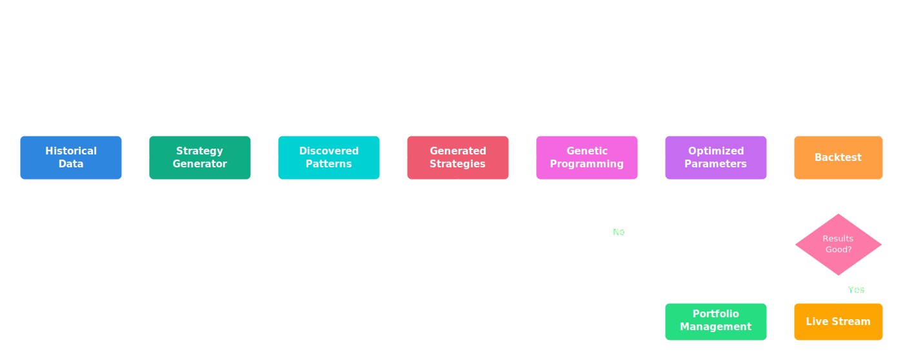

# Advanced Features

Explore SQA's advanced capabilities for professional-grade analysis.

## Power Tools for Serious Analysis

SQA goes beyond basic technical analysis with powerful features for portfolio management, strategy optimization, and real-time trading.

## Available Features

### Portfolio Management
Track positions, calculate P&L, manage commissions, and monitor portfolio performance.

**Key Capabilities:**
- Position tracking with share quantities
- Commission and fee calculations
- Realized and unrealized P&L
- Portfolio value over time

[Learn more →](portfolio.md)

### Backtesting Framework
Simulate trading strategies on historical data with comprehensive performance metrics.

**Performance Metrics:**
- Total return and annualized return
- Sharpe ratio and Sortino ratio
- Maximum drawdown
- Win rate and profit factor

[Learn more →](backtesting.md)

### Strategy Generator
Reverse-engineer profitable trades to discover patterns and generate new strategies.

**Workflow:**
1. Identify profitable entry/exit points
2. Capture indicator states at those points
3. Mine patterns from indicator combinations
4. Generate executable strategies

[Learn more →](strategy-generator.md)

### Genetic Programming
Evolve optimal strategy parameters using genetic algorithms.

**Process:**
- Define parameter space (genes)
- Create random population
- Evaluate fitness via backtesting
- Evolve through selection, crossover, mutation

[Learn more →](../genetic_programming.md)

### Real-Time Streaming
Process live price data with event callbacks and parallel strategy execution.

**Features:**
- Rolling window of recent data
- On-the-fly indicator calculations
- Multiple strategies in parallel
- Customizable callbacks

[Learn more →](streaming.md)

### FPOP Analysis
Future Period of Performance analysis for risk/reward calculations.

**Capabilities:**
- Calculate future returns
- Direction classification
- Risk/reward metrics
- Performance attribution

[Learn more →](fpop.md)

## Example Workflow

## Use Cases

### Quantitative Research
- Pattern discovery in historical data
- Parameter optimization
- Strategy validation

### Algorithmic Trading (Educational)
- Real-time signal generation
- Portfolio tracking
- Performance monitoring

### Risk Management
- Drawdown analysis
- Volatility tracking
- Position sizing

---

**Remember**: These are powerful tools for education and research. Always test thoroughly before considering any real trading applications.
