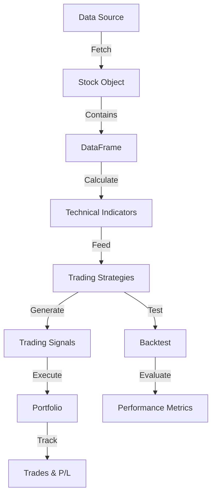

# Core Concepts

Understanding the fundamental building blocks of SQA.

## Overview

SQA is built around several key concepts that work together to provide a comprehensive stock analysis framework:

- **Stock Objects** - Represent individual stocks with historical data
- **DataFrames** - High-performance time series data structures
- **Technical Indicators** - Mathematical calculations on price/volume data
- **Trading Strategies** - Rules for generating buy/sell/hold signals
- **Portfolio Management** - Track positions and calculate P&L
- **Backtesting** - Simulate strategies on historical data

## Architecture Diagram

## Learn More

-   :material-table:{ .lg .middle } __DataFrames__

    ---

    High-performance data structures powered by Polars

    [:octicons-arrow-right-24: DataFrame Guide](../data_frame.md)

-   :material-chart-bell-curve:{ .lg .middle } __Indicators__

    ---

    150+ technical analysis indicators via sqa-tai gem

    [:octicons-arrow-right-24: Indicators](../indicators/index.md)

-   :material-strategy:{ .lg .middle } __Strategies__

    ---

    Framework for creating and executing trading strategies

    [:octicons-arrow-right-24: Strategies](../strategy.md)

