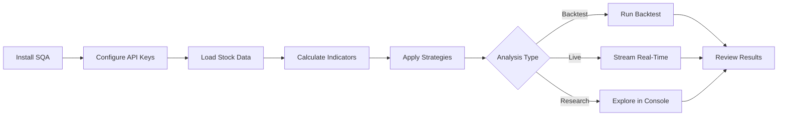

# Getting Started with SQA

Welcome to SQA! This guide will help you get up and running with stock market technical analysis in just a few minutes.

## What You'll Learn

In this section, you'll learn how to:

- Install SQA and its dependencies
- Configure your environment for data access
- Run your first analysis
- Use the interactive console
- Understand the basic workflow

## Prerequisites

Before you begin, make sure you have:

- **Ruby 3.2+** installed on your system
- **TA-Lib C library** (for technical indicators)
- **(Optional) Alpha Vantage API key** for live data access

## Quick Navigation

<div class="grid cards" markdown>

-   :material-download:{ .lg .middle } __Installation__

    ---

    Install SQA and set up TA-Lib for technical analysis

    [:octicons-arrow-right-24: Installation Guide](installation.md)

-   :material-rocket-launch:{ .lg .middle } __Quick Start__

    ---

    Get your first analysis running in minutes

    [:octicons-arrow-right-24: Quick Start Guide](quick-start.md)

</div>

## Typical Workflow

Here's the typical workflow when using SQA:



## What's Next?

Once you've completed the getting started guides, you can explore:

- **[Core Concepts](../concepts/index.md)** - Deep dive into SQA's architecture
- **[Technical Indicators](../indicators/index.md)** - Learn about the 150+ indicators
- **[Trading Strategies](../strategies/index.md)** - Explore built-in and custom strategies
- **[Advanced Features](../advanced/index.md)** - Portfolio management, backtesting, and more

## Need Help?

If you run into issues:

1. Check the [Troubleshooting](#troubleshooting) section below
2. Review the [Requirements](../requirements.md) page
3. Visit our [GitHub Issues](https://github.com/madbomber/sqa/issues)

## Troubleshooting

### Common Issues

**Ruby Version Too Old**
```bash
ruby --version  # Should be 3.2 or higher
rbenv install 3.3.6  # Or rvm install ruby-3.3.6
```

**TA-Lib Not Found**
```bash
# See the Installation guide for TA-Lib setup
# Quick check:
ls /usr/local/lib/libta_lib.*
```

**API Key Issues**
```bash
# Set your Alpha Vantage API key
export AV_API_KEY="your_key_here"
# Or add to ~/.bashrc for persistence
```

---

Ready to install? Let's get started with the **[Installation Guide](installation.md)**!
