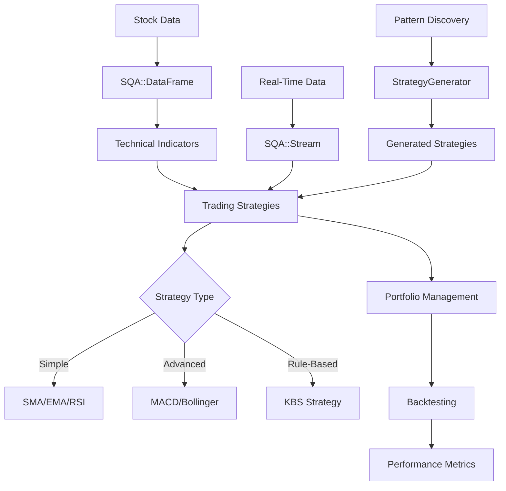

# SQA - Simple Qualitative Analysis

<p align="center">
  <strong>A Powerful Ruby Library for Stock Market Technical Analysis</strong>
</p>

---

## Welcome to SQA

**SQA (Simple Qualitative Analysis)** is an educational Ruby library designed for stock market technical analysis and trading strategy development. Built with high-performance data structures and seamlessly integrated with TA-Lib, SQA provides a comprehensive toolkit for analyzing historical stock data, implementing trading strategies, and backtesting your ideas.

!!! warning "Educational Purpose Only"
    SQA is designed for **educational purposes** only. It should not be used for actual trading without extensive testing and professional financial advice. Trading stocks involves substantial risk of loss.

## Why SQA?

### :zap: High Performance
- **Polars DataFrames**: Rust-backed data structures providing 30x faster operations than pure Ruby
- **TA-Lib Integration**: Access to 150+ battle-tested technical indicators via the `sqa-tai` gem
- **Efficient Algorithms**: Optimized for large historical datasets

### :toolbox: Comprehensive Feature Set
- **13+ Trading Strategies**: From simple moving averages to advanced machine learning-based strategies
- **Portfolio Management**: Track positions, calculate P&L, manage commissions
- **Backtesting Framework**: Simulate strategies with comprehensive performance metrics
- **Real-Time Streaming**: Process live price data with callback support
- **Strategy Generation**: Reverse-engineer profitable trades to discover patterns
- **Genetic Programming**: Evolve optimal strategy parameters

### :mortar_board: Educational Focus
- **Clear Documentation**: Extensive guides and examples
- **Transparent Algorithms**: Understand how each indicator and strategy works
- **Modular Design**: Learn by building custom strategies
- **Risk Disclaimers**: Honest about limitations and risks

## Quick Example

```ruby
require 'sqa'

# Initialize SQA
SQA.init

# Load stock data
stock = SQA::Stock.new(ticker: 'AAPL')

# Get price data
prices = stock.df["adj_close_price"].to_a

# Calculate RSI indicator
rsi = SQAI.rsi(prices, period: 14)

# Execute RSI trading strategy
require 'ostruct'
vector = OpenStruct.new(rsi: { trend: rsi.last < 30 ? :over_sold : :over_bought })
signal = SQA::Strategy::RSI.trade(vector)  # => :buy, :sell, or :hold

# Backtest the strategy
backtest = SQA::Backtest.new(
  stock: stock,
  strategy: SQA::Strategy::RSI,
  initial_cash: 10_000
)
results = backtest.run

puts "Total Return: #{results.total_return}%"
puts "Sharpe Ratio: #{results.sharpe_ratio}"
puts "Max Drawdown: #{results.max_drawdown}%"
```

## Core Features

### Data Management
- **Multiple Data Sources**: Alpha Vantage, Yahoo Finance, CSV imports
- **Polars DataFrames**: High-performance time series data manipulation
- **Automatic Updates**: Keep historical data current

### Technical Analysis
- **150+ Indicators**: SMA, EMA, RSI, MACD, Bollinger Bands, Stochastic, ADX, ATR, and more
- **Custom Calculations**: Build your own indicators
- **Trend Detection**: Identify market conditions automatically

### Trading Strategies
- **Built-in Strategies**: RSI, MACD, Bollinger Bands, Moving Average crossovers, Volume Breakout
- **Strategy Framework**: Plugin architecture for custom strategies
- **Consensus Approach**: Combine multiple strategies
- **Rule-Based (KBS)**: RETE-based forward-chaining inference engine

### Advanced Analytics
- **Portfolio Tracking**: Monitor positions, P&L, commissions
- **Backtesting**: Historical simulation with performance metrics
- **Strategy Generator**: Mine patterns from profitable trades
- **Genetic Programming**: Evolutionary parameter optimization
- **FPOP Analysis**: Future Period of Performance calculations
- **Real-Time Streaming**: Process live data with event callbacks

## Architecture



## Getting Started

Ready to dive in? Check out our guides:

- **[Installation Guide](getting-started/installation.md)** - Get SQA up and running
- **[Quick Start](getting-started/quick-start.md)** - Your first analysis in minutes
- **[Configuration](getting-started/configuration.md)** - Customize SQA for your needs
- **[Console Usage](getting-started/console-usage.md)** - Interactive exploration with `sqa-console`

## Key Resources

### For Beginners
- [Core Concepts](concepts/index.md) - Understand the fundamentals
- [Technical Indicators](indicators/index.md) - Learn about indicators
- [Trading Strategies](strategies/index.md) - Explore built-in strategies

### For Advanced Users
- [Portfolio Management](advanced/portfolio.md) - Track your trades
- [Backtesting](advanced/backtesting.md) - Test strategies historically
- [Strategy Generator](advanced/strategy-generator.md) - Discover patterns
- [Genetic Programming](genetic_programming.md) - Optimize parameters

### Reference
- [API Documentation](api/index.md) - Complete API reference
- [Data Sources](data-sources/index.md) - Working with data
- [Terms of Use](terms_of_use.md) - Important legal information

## Community & Support

- **GitHub**: [github.com/madbomber/sqa](https://github.com/madbomber/sqa)
- **RubyGems**: [rubygems.org/gems/sqa](https://rubygems.org/gems/sqa)
- **Issues**: Report bugs or request features on [GitHub Issues](https://github.com/madbomber/sqa/issues)

## License

SQA is released under the MIT License. See the [LICENSE](https://github.com/madbomber/sqa/blob/main/LICENSE.txt) file for details.

---

<p align="center">
  <strong>Remember: The House Always Wins</strong><br>
  <em>Trade responsibly. Never risk more than you can afford to lose.</em>
</p>
