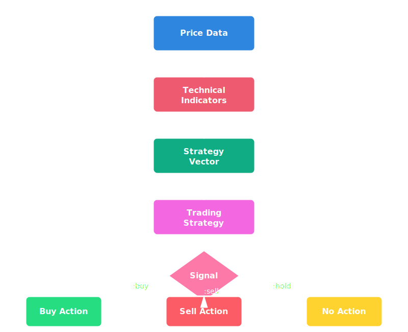

# Strategy Framework

A comprehensive guide to SQA's trading strategy architecture.

## Overview

A strategy in SQA is a set of rules that analyze technical indicators and market data to generate trading signals. The `SQA::Strategy` class provides the framework for managing and executing multiple strategies.

## Architecture



## The Strategy Pattern

All SQA strategies follow a common interface:

```ruby
class SQA::Strategy::YourStrategy
  def self.trade(vector)
    # Analyze the vector (OpenStruct with indicator data)
    # Return :buy, :sell, or :hold
  end
end
```

### The Vector

The vector is an `OpenStruct` containing all the data a strategy needs to make a decision:

```ruby
require 'ostruct'

vector = OpenStruct.new(
  rsi: { trend: :over_sold, value: 28.5 },
  macd: { crossover: :bullish, histogram: 0.5 },
  prices: prices_array,
  sma_20: sma_20.last,
  sma_50: sma_50.last
)
```

## Using the Strategy Framework

### Managing Multiple Strategies

```ruby
# Create a strategy manager
strategy = SQA::Strategy.new

# Add strategies
strategy.add SQA::Strategy::RSI
strategy.add SQA::Strategy::MACD
strategy.add SQA::Strategy::BollingerBands

# Execute all strategies
signals = strategy.execute(vector)
# => [:buy, :hold, :sell]

# Count votes for consensus
buy_votes = signals.count(:buy)
sell_votes = signals.count(:sell)
```

### Auto-Loading Strategies

```ruby
# Load all built-in strategies
strategy = SQA::Strategy.new
strategy.auto_load

# Load specific strategies only
strategy.auto_load(only: [:rsi, :macd])

# Load all except certain strategies
strategy.auto_load(except: [:random, :common])
```

### Listing Available Strategies

```ruby
strategy = SQA::Strategy.new
available = strategy.available
# => [SQA::Strategy::RSI, SQA::Strategy::MACD, ...]
```

## Built-in Strategies

SQA includes 13+ built-in trading strategies:

### Trend-Following

| Strategy | Description | Best For |
|----------|-------------|----------|
| **SMA** | Simple Moving Average crossovers | Trending markets |
| **EMA** | Exponential Moving Average crossovers | Faster trend detection |
| **MACD** | Moving Average Convergence Divergence | Momentum + trend |

### Momentum

| Strategy | Description | Best For |
|----------|-------------|----------|
| **RSI** | Relative Strength Index (oversold/overbought) | Range-bound markets |
| **Stochastic** | Stochastic oscillator crossovers | Short-term reversals |

### Volatility

| Strategy | Description | Best For |
|----------|-------------|----------|
| **Bollinger Bands** | Price touching volatility bands | Volatile markets |
| **Volume Breakout** | High volume price breakouts | Breakout trading |

### Advanced

| Strategy | Description | Best For |
|----------|-------------|----------|
| **KBS** | Knowledge-Based System with RETE engine | Complex rule combinations |
| **Consensus** | Aggregates multiple strategy signals | Reducing noise |
| **Mean Reversion** | Statistical mean reversion | Range-bound markets |

## Creating Custom Strategies

### Basic Template

```ruby
# lib/my_strategies/awesome_strategy.rb

class SQA::Strategy::AwesomeStrategy
  def self.trade(vector)
    # Your trading logic here
    if buy_condition?(vector)
      :buy
    elsif sell_condition?(vector)
      :sell
    else
      :hold
    end
  end

  private

  def self.buy_condition?(vector)
    vector.rsi[:value] < 30 &&
    vector.macd[:crossover] == :bullish
  end

  def self.sell_condition?(vector)
    vector.rsi[:value] > 70 &&
    vector.macd[:crossover] == :bearish
  end
end
```

### Using Your Strategy

```ruby
require_relative 'my_strategies/awesome_strategy'

# Execute directly
signal = SQA::Strategy::AwesomeStrategy.trade(vector)

# Or add to strategy manager
strategy = SQA::Strategy.new
strategy.add SQA::Strategy::AwesomeStrategy
```

### Strategy with Configuration

```ruby
class SQA::Strategy::ConfigurableRSI
  @oversold_threshold = 30
  @overbought_threshold = 70

  class << self
    attr_accessor :oversold_threshold, :overbought_threshold

    def trade(vector)
      rsi_value = vector.rsi[:value] || vector.rsi

      if rsi_value < oversold_threshold
        :buy
      elsif rsi_value > overbought_threshold
        :sell
      else
        :hold
      end
    end
  end
end

# Configure before using
SQA::Strategy::ConfigurableRSI.oversold_threshold = 25
SQA::Strategy::ConfigurableRSI.overbought_threshold = 75
```

## Combining Strategies

### Consensus Strategy

The built-in Consensus strategy aggregates signals from multiple strategies:

```ruby
# Simple majority vote
signals = strategy.execute(vector)
# => [:buy, :buy, :hold, :sell]

consensus = signals.group_by(&:itself)
                   .transform_values(&:count)
                   .max_by { |_, v| v }
                   .first
# => :buy (2 votes vs 1 each for hold/sell)
```

### Weighted Voting

```ruby
# Assign weights to strategies
weights = {
  SQA::Strategy::RSI => 2.0,      # RSI gets double weight
  SQA::Strategy::MACD => 1.5,     # MACD gets 1.5x weight
  SQA::Strategy::SMA => 1.0       # SMA gets normal weight
}

# Calculate weighted consensus
weighted_votes = { buy: 0.0, sell: 0.0, hold: 0.0 }
signals.each_with_index do |signal, i|
  weight = weights.values[i]
  weighted_votes[signal] += weight
end

final_signal = weighted_votes.max_by { |_, v| v }.first
```

## Testing Strategies

### Unit Testing

```ruby
# test/strategy/awesome_strategy_test.rb
require 'minitest/autorun'
require 'ostruct'

class AwesomeStrategyTest < Minitest::Test
  def test_buy_signal_on_oversold
    vector = OpenStruct.new(
      rsi: { value: 25, trend: :over_sold },
      macd: { crossover: :bullish }
    )

    assert_equal :buy, SQA::Strategy::AwesomeStrategy.trade(vector)
  end

  def test_sell_signal_on_overbought
    vector = OpenStruct.new(
      rsi: { value: 75, trend: :over_bought },
      macd: { crossover: :bearish }
    )

    assert_equal :sell, SQA::Strategy::AwesomeStrategy.trade(vector)
  end
end
```

### Backtesting

```ruby
backtest = SQA::Backtest.new(
  stock: stock,
  strategy: SQA::Strategy::AwesomeStrategy,
  initial_cash: 10_000
)

results = backtest.run
puts "Return: #{results.total_return}%"
puts "Sharpe: #{results.sharpe_ratio}"
```

## Strategy Internals

### How Strategies Process Data

1. **Data Preparation**: Raw price data is converted to indicators
2. **Vector Creation**: Indicators are packaged into an OpenStruct
3. **Strategy Execution**: Each strategy analyzes the vector
4. **Signal Generation**: Strategy returns `:buy`, `:sell`, or `:hold`
5. **Aggregation**: Signals can be combined for consensus

### Data Ordering

All indicator data in SQA follows **ascending chronological order** (oldest first):

```ruby
# prices[0] = oldest price
# prices[-1] = most recent price

prices = stock.df["adj_close_price"].to_a
rsi = SQAI.rsi(prices, period: 14)

# rsi.last is the most recent RSI value
current_rsi = rsi.last
```

## Best Practices

### 1. Keep Strategies Simple

```ruby
# GOOD: Clear, single-purpose logic
def self.trade(vector)
  vector.rsi[:value] < 30 ? :buy : :hold
end

# BAD: Complex nested conditions
def self.trade(vector)
  if vector.rsi[:value] < 30
    if vector.macd[:histogram] > 0
      if vector.volume > vector.avg_volume * 1.5
        # ... more nesting ...
      end
    end
  end
end
```

### 2. Use Named Parameters in Vectors

```ruby
# GOOD: Self-documenting
vector = OpenStruct.new(
  rsi_value: rsi.last,
  rsi_trend: rsi.last < 30 ? :oversold : :neutral,
  sma_20: sma_20.last,
  sma_50: sma_50.last
)

# BAD: Magic numbers
vector = OpenStruct.new(
  val1: 28.5,
  val2: 150.0,
  val3: 148.0
)
```

### 3. Handle Edge Cases

```ruby
def self.trade(vector)
  return :hold if vector.rsi.nil?
  return :hold if vector.prices.empty?

  # Main logic here
end
```

### 4. Document Your Strategy

```ruby
# Dual Moving Average Crossover Strategy
#
# Generates buy signals when short MA crosses above long MA,
# sell signals when short MA crosses below long MA.
#
# Parameters:
#   vector.sma_short - Short-term SMA (e.g., 20-day)
#   vector.sma_long - Long-term SMA (e.g., 50-day)
#
# Returns:
#   :buy - Short MA > Long MA (bullish crossover)
#   :sell - Short MA < Long MA (bearish crossover)
#   :hold - No clear signal
#
class SQA::Strategy::DualMA
  def self.trade(vector)
    # ...
  end
end
```

## Related Documentation

- [Trading Strategies Reference](strategies/index.md) - Details on each built-in strategy
- [Custom Strategies](strategies/custom.md) - Guide to creating your own
- [Backtesting](advanced/backtesting.md) - Test strategies on historical data
- [Technical Indicators](indicators/index.md) - Calculate indicator values
